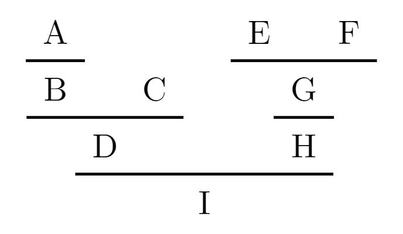

# typst-prooftree

`typst-prooftree` allows you to draw proof trees in [Typst](https://typst.app/). Heavily inspired by Latex's [bussproofs](https://www.ctan.org/pkg/bussproofs) package.

Feel free to open an issue or a pull request if you have a question or there's something missing you would like to see.

# Getting started

Copy the [`prooftree.typ`](prooftree.typ) file to your project or add this repository as a submodule to yours. Then you just need:

```js
#import "../prooftree.typ": *
```

at the top of your current file and you're ready to go!

# Example



You can generate the image above with the following code:

```js
#import "../prooftree.typ": *

#prooftree(
  axiom("A"),
  rule("B"),
  axiom("C"),
  rule(n: 2, "D"),
  axiom("E"),
  axiom("F"),
  rule(n: 2, "G"),
  rule("H"),
  rule(n: 2, "I")
)
```

# How it works

## `prooftree`

```js
let prooftree(
  spacing: (
    horizontal: 1.5em,
    vertical: 0.5em,
    lateral: 0.5em,
  ),
  label: (
    side: left,
  ),
  ..rules
) = /* ... */
```

The main function exported by this library is `prooftree`. If you're familiar with `bussproofs`, this function acts like its `prooftree` environment. `prooftree` describes the proof tree like a stack, taking its elements as positional arguments. `axiom`s gets pushed into a stack and become the leaves, while `rule`s pop trees from such stack, combine them into a new tree and push them back, becoming the middle nodes.

Moreover this functions takes the following named arguments:

- `spacing`: a dictionary of spacing related arguments, in particular:
  - `horizontal` or `h`: `length`s that regulate the horizontal spacing between sibling rules (default: `1.5em`).
  - `vertical` or `v`: `length`s that regulate the vertical spacing between the rules and the horizontal lines (default: `0.5em`);
  - `lateral` or `l`: `length`s that regulate the horizontal spacing on the sides of each rules (default: `0.5em`); the difference between this and `horizontal` is that this spacing enlarges the horizontal lines.
- `label`: a dictionary of label related arguments, in particular:
  - `side`: `alignment` that regulates the default side of labels on rules, but not axioms (default: `left`). Possible values are `left` and `right`.

## `axiom`

```js
let axiom(label: none, body) = /* ... */
```

`axiom`'s job is to describe the leaves of the proof tree. It takes the following arguments:
- `label`: a named argument containing the label of the axiom. This can be `none` (default) or a `string` or `content`, containing the actual label to display;
- `body`: a positional argument containing the body of the axiom. Can be anything and will be displayed as is.

## `rule`

```js
let rule(n: 1, label: none, root) = /* ... */
```

`rule` pops a given number of proof trees from the `prooftree`'s stack and adds a common root to them. It takes the following arguments:
- `n`: a named argument representing the number of proof trees to pop (default: 1). Currently `n: 0` is equivalent to using `axiom`, but this may change in the future;
- `label`: a named argument representing the label(s) to show. It can be either:
  - `none`, in which case no label is shown;
  - a `string` or `content`, in which case a label is shown on the default side of the `prooftree`;
  - a `dictionary` having `left` and/or `right` as keys, in which case the values associated to each key will be shown on the relative side. 
